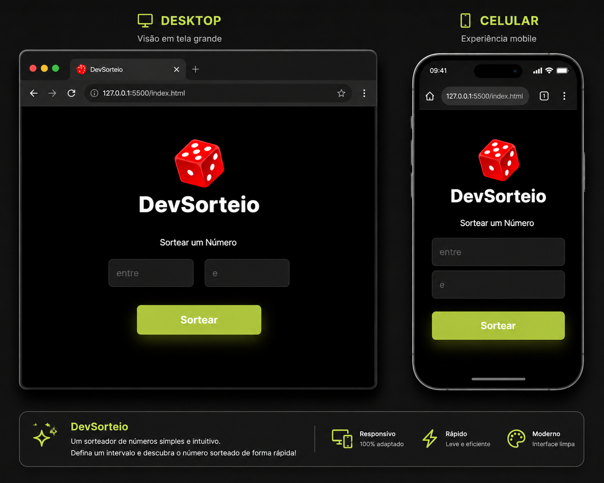

# 🎲 DevSorteio

Um sorteador de números simples, rápido e intuitivo desenvolvido com HTML, CSS e JavaScript.

## 🚀 Demonstração

🔗 Acesse o projeto: [Clique aqui](COLE_AQUI_O_LINK_DO_GITHUB_PAGES)

---

## 📸 Preview

---

## ✨ Funcionalidades

- Sorteio de números aleatórios
- Definição de valor mínimo e máximo
- Interface moderna e responsiva
- Compatível com dispositivos móveis
- Design com tema escuro

---

## 🛠️ Tecnologias Utilizadas

  
  
  

- HTML5
- CSS3
- JavaScript

---

## 📚 Aprendizados

Durante o desenvolvimento deste projeto foram praticados conceitos como:

- Manipulação do DOM
- Eventos JavaScript
- Funções matemáticas (`Math.random()`)
- Responsividade com CSS
- Estruturação de interfaces modernas

---

## 🎯 Objetivo

Este projeto foi desenvolvido como parte dos estudos de desenvolvimento Front-End, com foco em lógica de programação, JavaScript e criação de interfaces responsivas.

---

## 👨‍💻 Autor

Desenvolvido por **Christian Marcel de Pinho**

🔗 GitHub: https://github.com/ChristianPinho
